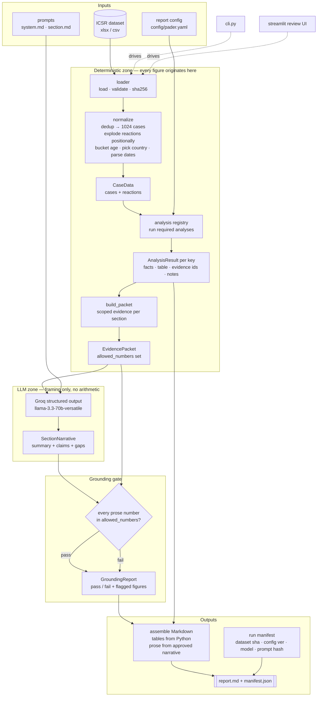
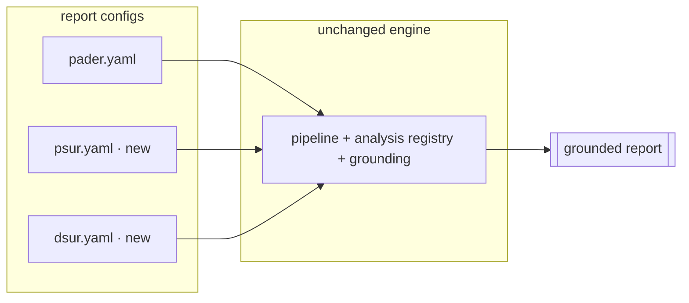

# Architecture

## Design principle

One hard split runs through the whole system:

- **Python computes every number, table, percentage, date, and trend.**
- **The LLM only frames pre-computed figures into neutral regulatory prose. It never calculates.**

A grounding gate sits between the LLM and the report: every number that appears in the
narrative must trace back to a figure the analysis layer produced, or the section fails.

## End-to-end flow

## Why the pieces exist

| Component | Responsibility | AI or deterministic |
|---|---|---|
| `src/data/loader.py` | load xlsx/csv, validate shape, hash for the manifest | deterministic |
| `src/data/normalize.py` | dedup to latest case version, positional reaction explode, age buckets, country, dates | deterministic |
| `src/analysis/` | registry of analyses; each returns figures + tables + the case ids behind every number | deterministic |
| `src/evidence/packet.py` | assemble the scoped evidence a section is allowed to cite | deterministic |
| `src/llm/` | Groq structured-output wrapper + `SectionNarrative` schema; frames figures into prose | AI |
| `src/eval/grounding.py` | verify every prose number is in the packet's allow-list | deterministic |
| `src/report/` | render tables from Python + prose from the approved narrative into Markdown | deterministic |
| `src/pipeline.py` | orchestrate the flow, emit the reproducibility manifest | deterministic |
| `config/pader.yaml` | declares the report: sections, modes, required analyses | config |

## Config-driven extensibility

A report type is a YAML file, not code. Each section declares a `mode`
(`table` = computed table only, `narrative` = prose only, `both`) and the
`required_analyses` it may cite.

Adding PSUR/PBRER/DSUR means writing a new YAML (and, only if it needs a figure
no analysis yet produces, a new `@register`-ed analysis function). The pipeline,
grounding gate, and assembler do not change.
